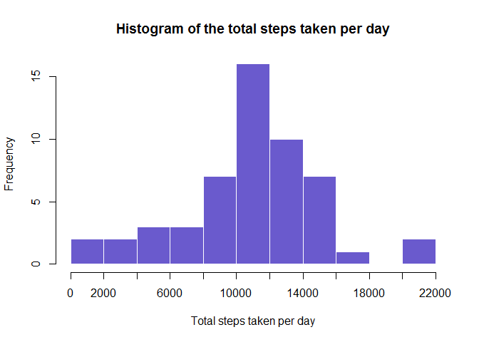
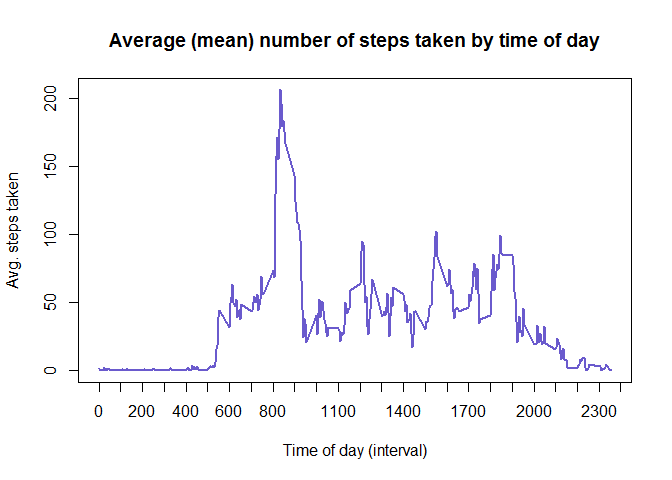
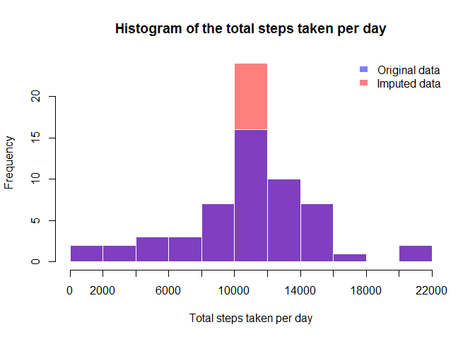

# Reproducible Research: Peer Assessment 1


## Loading and preprocessing the data

Befotre loading the data into R we are going to set the download
url, the name of the zip file where the data is downloaded to and the filename 
to be loaded into R.


```r
# set the filenames and doanload locations
fileurl <- "https://d396qusza40orc.cloudfront.net/repdata%2Fdata%2Factivity.zip"
zipname <- "activity.zip"
filename <- "activity.csv"
```

Then, if the file is not present in the working directory we will download it 
to the file *activity.zip*. Once downloaded, we'll unziped it (if not already
done so) and load it into a dataset called *activities*.


```r
# download the file if not already there
if(!file.exists(zipname)) {download.file(url = fileurl, destfile = zipname)}

# unzip the file, if it hasn't been done already
if(!file.exists(filename)) {unzip(zipname)}

# load the file into R
if(!exists("activity")) activity <- read.csv(filename, stringsAsFactors = FALSE)
```

## What is mean total number of steps taken per day?

First, we'll calculate the total number of steps taken each day by using tapply
(ignoring the the NA's). 

```r
# calculate the total steps taken per day
totalsteps <- with(subset(activity, !is.na(steps)),tapply(steps, date, sum))
```

We'll make a histogram of the total number of steps taken each day. We will 
override the default breaks to 10 (insead of 5) in order for the chart to be 
more informative.

```r
# make a histogram of the steps taken per day
hist(totalsteps, 
     breaks = 10,
     border = "white",
     main = "Histogram of the total steps taken per day",
     col = "slateblue",
     xlab = "Total steps taken per day",
     xaxp = c(0,22000, 11))
```

<!-- -->

The mean and median of the total number of steps taken per day are as follows:


```r
# print out the mean and median of totalsteps
summary(totalsteps)[3:4]
```

```
## Median   Mean 
##  10760  10770
```

## What is the average daily activity pattern?

To answer this, we'll first calculate the mean number of steps taken per 
interval across all days (ignoring the the NA's). 

```r
# calculate the mean of the steps taken per interval
meansteps <- with(subset(activity,!is.na(steps)), tapply(steps, interval, mean))
```

Then, we'll make a time series plot showing the average number of steps taken 
in each of the 5-minute intervals.

```r
# plot meansteps 
plot(x = names(meansteps),
     y = meansteps,
     type = "l",
     lwd = 2, 
     col = "slateblue", 
     xaxp = c(0, 2400, 24),
     xlab = "Time of day (interval)",
     ylab = "Avg. steps taken",
     main = "Average (mean) number of steps taken by time of day"
     )
```

<!-- -->


We'll get interval with the maximum number of of steps taken.

```r
# get the interval
maxint <- as.numeric(names(which.max(meansteps)))

# format the interval
maxint <- paste(
    sprintf("%02d", floor(maxint/100)),
    sprintf("%02d", maxint - floor(maxint/100) *100 ),
    sep = ":"
)
maxint
```

```
## [1] "08:35"
```

The time of day during which, on average, the most number of steps are taken is 08:35.

## Imputing missing values

We're going to calculate and report the total number of missing values in the dataset 
(i.e. the total number of rows with `NA`s). 

But before we do so, we'll check which columns contain NA's.

```r
# which coumns contain NA's
apply(activity, 2, function(x) any(is.na(x)))
```

```
##    steps     date interval 
##     TRUE    FALSE    FALSE
```

There are only NA's in the *steps* variable. Hence the total number of NA's in 
each row is simply the number of NA's in the variable *steps*.

```r
# count the total number of NA's   
sum(is.na(activity$steps))
```

```
## [1] 2304
```

Now, to impute the values we will replace the NA's with the mean for that 
5-minute interval across all days.


```r
# make a copy of the dataset, where values are going to be imputed
imputed <- activity

# impute the missing values
missing <- is.na(imputed$steps)

imputed[missing, 1] <- sapply(imputed[missing, 3], 
                              function(x) meansteps[as.character(x)])
```

To confirm that everything worked, we'll check if any NA's are left in the
imputed dataset.

```r
# check if there are any NA's left
any(is.na(imputed$steps))
```

```
## [1] FALSE
```


Now, we can make a histogram of the total number of steps taken each day. To
see what impact the imputing of the value had, we'll super-impose the 
histograms for the original and imputed datasets.

```r
# compute the total steps of the imputed dataset
totalstepsimputed <- with(imputed,tapply(steps, date, sum, rm.na = TRUE))

# make a historgram showing both the imputed and original dataset 
hist(totalstepsimputed, 
     breaks = 15,
     border = "white",
     main = "Histogram of the total steps taken per day",
     col = rgb(1,0,0,0.5),
     xlab = "Total steps taken per day",
     xaxp = c(0,22000, 11))
hist(totalsteps, 
     breaks = 15,
     border = "white",
     col = rgb(0,0,1,0.5),
     add = T)
legend("topright", 
       fill  = c(rgb(0,0,1,0.5),rgb(1,0,0,0.5)),
       legend = c("Original data", "Imputed data"),
       border = "white",
       box.col = "white")
```

<!-- -->

```r
totalstepsimputed[is.na(totalsteps)]
```

```
## named numeric(0)
```

Imputing the missing values seems to have replaced the days with NA's with one 
value the only which seems to be close to the mean of the total number of steps 
taken per day. To confirm that, lets look all the values of *steps taken per day*
for which we didn't have values before.


```r
# get the new values for totalsteps which we got through imputing the data
totalstepsimputed[!(names(totalstepsimputed) %in% names(totalsteps))]
```

```
## 2012-10-01 2012-10-08 2012-11-01 2012-11-04 2012-11-09 2012-11-10 
##   10767.19   10767.19   10767.19   10767.19   10767.19   10767.19 
## 2012-11-14 2012-11-30 
##   10767.19   10767.19
```

So all days that had missing values now have a total of 10767.19 steps. Now, we
will check what impact this had on our median and mean.

```r
library(xtable)
```

```
## Warning: package 'xtable' was built under R version 3.3.1
```

```r
avgs <- sapply(list(totalsteps,totalstepsimputed),function(x) summary(x)[3:4])

colnames(avgs) <- c("Before imputing", "After imputing")
xt <- xtable(avgs)
print(xt, type = "html")
```

<!-- html table generated in R 3.3.0 by xtable 1.8-2 package -->
<!-- Mon Jul 11 08:35:01 2016 -->
<table border=1>
<tr> <th>  </th> <th> Before imputing </th> <th> After imputing </th>  </tr>
  <tr> <td align="right"> Median </td> <td align="right"> 10760.00 </td> <td align="right"> 10770.00 </td> </tr>
  <tr> <td align="right"> Mean </td> <td align="right"> 10770.00 </td> <td align="right"> 10770.00 </td> </tr>
   </table>

After imputing the data the mean has not changed - but the median increased
and is now equal to the mean.

## Are there differences in activity patterns between weekdays and weekends?


Create a new factor variable in the dataset with two levels -- "weekday" and "weekend" indicating whether a given date is a weekday or weekend day.


```r
# create a flag for weekday (1) and weekend (2)
imputed$daytype <- 1
isweekend <- weekdays(as.Date(imputed$date)) %in% c("Saturday","Sunday")
imputed[isweekend, "daytype"] <- 2

# convert the flag into a factor variable
imputed$daytype <- as.factor(imputed$daytype)
levels(imputed$daytype) <- c("weekday", "weekend")
```

Next, we'll compute the average number of steps taken by 5 minute
interval, averaged across all weekday days or weekend days.

```r
meansteps2 <- with(imputed, aggregate(x = list(steps = steps),
                                      by= list(interval = interval, 
                                               daytype = daytype),
                                      FUN = mean))
```

Finally, we can make the panel plot containing the time series plot for the 
weekend and weekday averages by interval.

```r
library(lattice) 
with(meansteps2, xyplot(steps~interval|daytype, type = "l", layout = c(1,2)))
```

<!-- -->

The plot seems to suggest that the activity levels by time interval for
weekends and weekdays are different.
